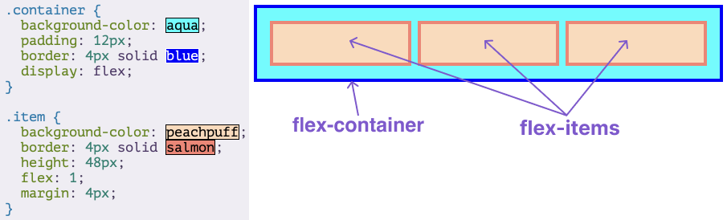
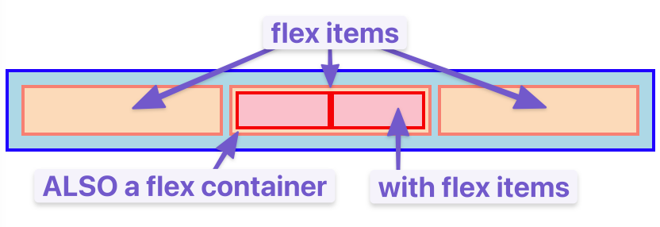

- Understanding **flex containers** and **flex items**.

### Key Concepts

- **Flex Container**:
  Any element with `display: flex` applied becomes a flex container. This container controls the layout of its direct children.

- **Flex Items**:
  The **direct children** of a flex container. These are the elements that flexbox positions and sizes.

- **Nesting**:
  Flex items themselves can be flex containers for their own children, allowing complex nested layouts.

---



### How Flexbox Works

- Items inside a flex container are laid out either in a **row** (default) or a **column**.
- Items **flex** (grow or shrink) to fill available space.
- Adding or removing flex items automatically adjusts the layout.
- You can control how items distribute space, align, wrap, and order.

--
-

Example:

```html
<div class="flex-container">
  <div class="flex-item">1</div>
  <div class="flex-item">2</div>
  <div class="flex-item">3</div>
</div>
```

```css
.flex-container {
  display: flex;
}
```

---

## 3. Main Axis and Cross Axis

- Flexbox works with two axes:

  - **Main axis**: The direction flex items are laid out (default: row/horizontal)
  - **Cross axis**: Perpendicular to the main axis (default: column/vertical)

---

## 4. Controlling Direction — `flex-direction`

You control the main axis direction using `flex-direction`.

```css
.flex-container {
  display: flex;
  flex-direction: row; /* default, horizontal */
  /* flex-direction: column; vertical stack */
  /* flex-direction: row-reverse; reverse horizontal */
  /* flex-direction: column-reverse; reverse vertical */
}
```

---

## 5. Wrapping Flex Items — `flex-wrap`

By default, flex items try to fit in one line. Use `flex-wrap` to allow items to wrap onto new lines.

```css
.flex-container {
  flex-wrap: nowrap; /* default, no wrap */
  /* flex-wrap: wrap; wrap to next line */
  /* flex-wrap: wrap-reverse; wrap but reverse the order */
}
```

---

## 6. Justify Content — Align items along the main axis

Controls how space is distributed between items horizontally (if `flex-direction: row`):

```css
.flex-container {
  justify-content: flex-start; /* items packed at start */
  /* justify-content: flex-end; items packed at end */
  /* justify-content: center; items centered */
  /* justify-content: space-between; even space between items */
  /* justify-content: space-around; even space around items */
  /* justify-content: space-evenly; equal space between and around */
}
```

---

## 7. Align Items — Align items along the cross axis

Controls how items align vertically (if `flex-direction: row`):

```css
.flex-container {
  align-items: stretch; /* default, items fill container height */
  /* align-items: flex-start; items at top */
  /* align-items: flex-end; items at bottom */
  /* align-items: center; items vertically centered */
  /* align-items: baseline; items aligned by text baseline */
}
```

---

## 8. Align Content — Align multiple lines on the cross axis

When flex items wrap onto multiple lines (`flex-wrap: wrap`), `align-content` controls spacing between those lines.

```css
.flex-container {
  align-content: flex-start;
  /* flex-end, center, space-between, space-around, stretch */
}
```

---

## 9. Flex Item Properties: How items behave inside container

### 9.1 `flex-grow`

How much a flex item grows relative to others.

```css
.flex-item {
  flex-grow: 1; /* grows to fill available space */
}
```

If one item has `flex-grow: 2` and another `flex-grow: 1`, the first will take twice as much space.

---

### 9.2 `flex-shrink`

How much a flex item shrinks when there isn’t enough space.

```css
.flex-item {
  flex-shrink: 1; /* default shrink */
}
```

Set to `0` if you don’t want the item to shrink.

---

### 9.3 `flex-basis`

The initial size of the flex item before growing or shrinking.

```css
.flex-item {
  flex-basis: 100px; /* item starts at 100px */
}
```

---

### 9.4 The `flex` shorthand

Combines grow, shrink, and basis in one property.

```css
.flex-item {
  flex: 1 1 100px; /* flex-grow:1, flex-shrink:1, flex-basis:100px */
  /* flex: 1; shorthand for flex-grow:1, flex-shrink:1, flex-basis:0 */
  /* flex: auto; shorthand for flex-grow:1, flex-shrink:1, flex-basis:auto */
}
```

---

## 10. Align Self — override cross axis alignment for individual item

```css
.flex-item {
  align-self: flex-start; /* or flex-end, center, baseline, stretch */
}
```

Overrides the container's `align-items` for that item.

---

## 11. Gap — spacing between flex items

```css
.flex-container {
  gap: 10px; /* adds space between items */
}
```

No need for margins on flex items for spacing if you use `gap`.
